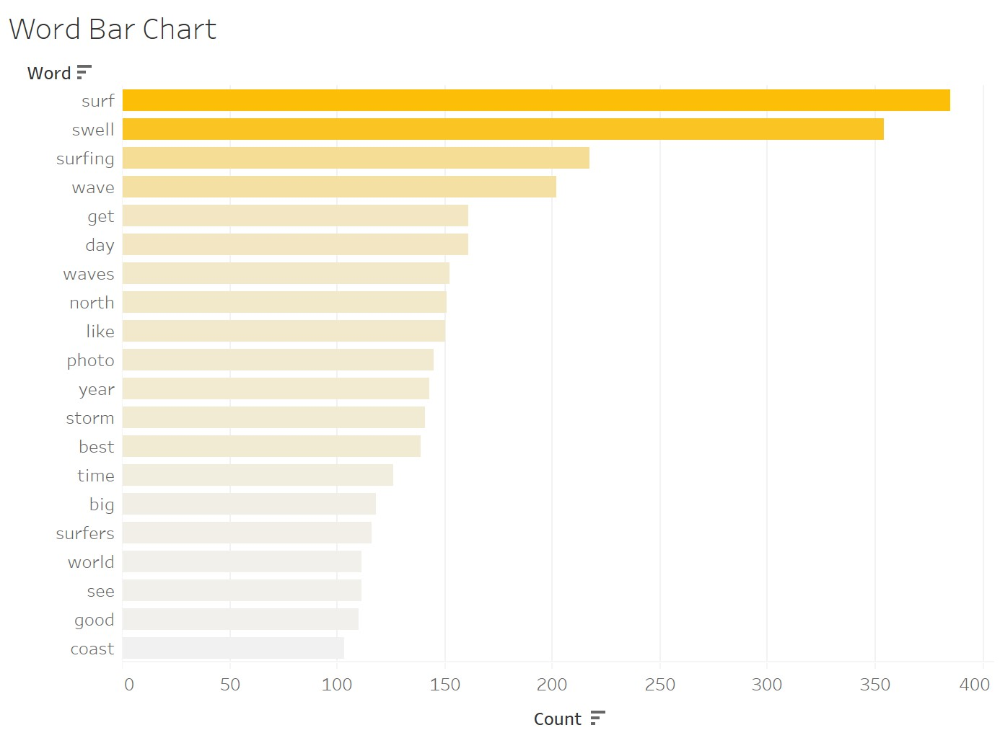
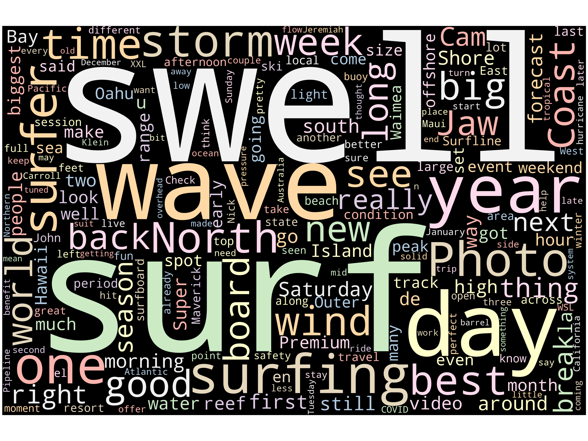

# Words By Surfline
## Created an app to scrape the news articles from Surfline.com's news page
#### Written by Jay Sueno

In this project I wanted to see what kinds of words Surfline uses in thier news and blog posts. Moreover, is there a way to visualize the findings and provide some insights about how they are positioning the brand in SEO? 

## Project Steps:
1. Develop a webscrapping app and upload into a MongoDB database - [code here](https://github.com/jaysueno/webscraping_surfline_blog/blob/main/app.py)
2. Clean and organize the data using Python and Pandas - [code here](https://github.com/jaysueno/webscraping_surfline_blog/blob/main/data_cleanup_notebook.ipynb)
3. Create a WordCloud visualization - [code here](https://github.com/jaysueno/webscraping_surfline_blog/blob/main/sufline_wordcloud_notebook.ipynb)
4. Conduct a sentiment analysis with ratings on each article - [code here](https://github.com/jaysueno/webscraping_surfline_blog/blob/main/sufline_wordcloud_notebook.ipynb)
5. Visualize findinggs with Tableau - [sample dashboard here](https://public.tableau.com/profile/jaysueno#!/vizhome/surflinewords/Dashboard1)

## Overall Findings
It comes to no surprise that Surfline's news articles use the word "surf" the most, at almost 400 uses in the articles. In fact surfline ranks fairly well on SEO for keyword phrases like "surf cam" and "surf report." (source: Moz.com) 

The next most used word was, "swell." As a forecasting service, the company talks in technical terms of wave dynamics. "Swell" is an important factor in gauging the quality of surf on hand. Here are a list of top words using Tableau to visualize ([please visit the Tableau Dashboard here](https://public.tableau.com/profile/jaysueno#!/vizhome/surflinewords/Dashboard1)):



## Webscrapping App
First, I created an app using Python and BeautifulSoup. It scrapes the data, in this case, the articles located on the [news page at Surfline.com](https://www.surfline.com/surf-news). The app automates the process of:
* Clicking on each article
* Pulling the date, headlines, and copy of each article
* Uploading the data into a local database (MongoDB) in json format

Here is an example of the code that shows how many articles are on the page:
```
news_links = soup.find_all('div', class_='quiver-feed-card__image')

# Print the number of articles and the first element contains element contents desired
print(f'Number of stories {len(news_links)}')
print(f'Example of the first html element block:')
print(news_links[3])
```
Here is the output of the code:
```
Number of stories 85
Example of the first html element block:
<div class="quiver-feed-card__image"><a aria-label="Feed Card Image" href="https://www.surfline.com/surf-news/watch-tom-carroll-matt-grainger-break-tow-foiling-glide-empty-outside-sydney-reef/100137" style='background-image: url("https://www.surfline.com/cdn-cgi/image/w=740,q=85,f=auto,fit=contain/https://d14fqx6aetz9ka.cloudfront.net/wp-content/uploads/2020/10/13192933/TC_Surfline_foil_oct20.jpg");' tabindex="0" target=""></a></div>
```

## Clean And Organize the Data Using Python Pandas 
Data is great, but you have to make it useful. This is the most time consuming part of data analysis, especially when using raw web-scrapped data. In this data wrangling process I needed to do the following ([find code here](data_cleanup_notebook.ipynb)):
* Use Python libraries like Pandas and NLTK
* Call the database with the information and convert it from a json to a csv
* Format the dates
* Oranize all the text copy into lists
* Tokenize the words and remove the stopwords (words like "the, and, a")
* Conduct a word count
* Create a dataframe from the data

Here's an example of what the dataframe looks like:


## Create a WordCloud
WordClouds aren't just visually appealing, they show the prominence of certain words in a body of work. Business intelligence and data insight need to be both informational and aesthetically appealing to convey the message properly. 

To see the code I used, go [here](surfline_wordcloud_notebook.ipynb). This is what Surfline.com's news article word cloud looks like:



## Sentiment Analysis
Words carry meaning. In this section I use [natural langauge processing](https://towardsdatascience.com/real-time-sentiment-analysis-on-social-media-with-open-source-tools-f864ca239afe) methods to give a rating on the words and articles. In this process we compared each of the words in the article with words from a database of words ranked on a scale of 1-10. The higher the number, the most positive the word score. 

Here's an example of the word scoring:


Through this analysis we have found that the average article sentiment is 5.67 with a high of 6.06 and a low of 4.95.

## Visualize The Data With Tableau
Please visit a [Tableau Dashboard I created here](https://public.tableau.com/profile/jaysueno#!/vizhome/surflinewords/Dashboard1) 

### How did sentiment change over time?
Note that the average sentiment of each article is <b>5.67</b>. Meaning that there's room for improvement if we want to increase the tone of the copy.


### How About Using A Bubble Chart To View Word Use?


### Word Count Over Time
Note that the average word count of each article was 452 words.


## Conclusion
This was a fun project to showcase some of my skills. If I had more proprietary data, I could compare our SEO, engagement, and news article writing strategy with some statistical methods. here are some of my findings and suggestions for further exploration:
* The most popular words are fairly obvious: "surf and "swell". Can we compare our SEO strategy and see how well we rank with actually using those keywords/phrases we want to rank on by raising the word count?
* Our average sentiment per article was 5.67. Can we test if the tone of the article being more positive, will increase the engagment and user experience? Is there a correlation?
* Surfline's reach is global, could we do an SEO and keyword scrape of our compeitors or sites where we want to pull users from. Then we can formulate an SEO strategy to attract those customers in different countries where we want to expand?

This project is to showcase some of my capabilities and show you how I think. Please message me with any questions and connect with me on [LinkedIn](https://www.linkedin.com/in/jaysueno).